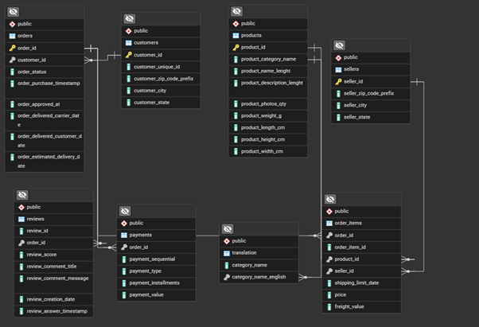

# Comprehensive E-commerce Data Analysis using SQL

## Project Overview

This project performs an in-depth analysis of a sample e-commerce dataset (Olist) using PostgreSQL. The goal is to extract actionable business insights related to orders, customers, sellers, payments, and customer segmentation using RFM analysis.

## Dataset

[Olist, via Kaggle](https://www.kaggle.com/datasets/olistbr/brazilian-ecommerce)

### Database Schema (ERD)

## Technologies Used

*   **Database:** PostgreSQL
*   **Visualization:** Charts generated using based on SQL query outputs.

## Analysis Structure

1.  **Case 1: Order Analysis:** Examining order trends, statuses, and popular product categories over time.
2.  **Case 2: Customer Analysis:** Identifying key customer geographic locations.
3.  **Case 3: Seller Analysis:** Evaluating seller performance based on delivery speed and product category diversity.
4.  **Case 4: Payment Analysis:** Investigating payment installment usage and popular payment methods.
5.  **Case 5: RFM Analysis:** Segmenting customers based on Recency, Frequency, and Monetary value to identify key groups like VIPs, loyal customers, and those at risk.

## Key Questions & Insights
Case 1: Order Analysis

1.1: Monthly Order Volume 

- Demonstrates significant growth throughout 2017 from a low 2016 base.
- Identifies a major peak in Nov 2017 (7,395 orders), confirming Black Friday's impact.
- Shows sustained high volume in early 2018 (Jan-Mar > 7,000).
- Indicates slight moderation/stabilization in mid-2018 volumes.
- Flags potential data incompleteness for Sep 2016, Dec 2016, Sep 2018.

1.2: Monthly Order Status Distribution 

- delivered status dominates, confirming high overall fulfillment rate.
- Significant unavailable counts (peak 86 in Nov 2017) indicate inventory/listing issues.
- Notable canceled counts (peak 71 in Feb 2018) require root cause analysis.
- Fluctuations in shipped counts reflect transit volume variations.

1.3: Top Product Categories by Month

- cama_mesa_banho shows sustained dominance, especially mid-2017 to early 2018 (peak 799 in Nov 2017).
- beleza_saude is consistently strong, rising to #1 in mid-late 2018.
- informatica_acessorios shows a major spike to #1 in Feb 2018 (808 orders).
- Home goods and personal care categories form the consistent core demand.
- Nov 2017 confirms Black Friday impact on home, leisure, and decor categories.

1.4a: Order Volume by Day of Week (DOW)

- Peak purchasing activity occurs on Tuesday (19,154 orders).
- Strong volume persists from Wednesday to Friday (>14.6k).
- Weekends, especially Sunday (9,014 orders), show significantly lower activity.
- Indicates a clear mid-week focus for customer purchasing.
- 160 orders have missing date information needing attention.

1.4b: Order Volume by Day of Month (DOM) 

- Identifies an anomalous major peak on the 24th (4,315 orders) requiring investigation.
- Shows generally strong purchasing activity in the first week (esp. day 5).
- Reveals relatively stable daily volumes mid-month (days 8-27, excl. 24th).
- Confirms a distinct drop-off in volume on the last days of the month (29-31).

Case 2: Customer Analysis

2.1: Top Customer Cities Analysis

- sao paulo is the overwhelmingly dominant city (15,540 orders).
- rio de janeiro is the clear second major hub (6,882 orders).
- Multiple other major cities (Belo Horizonte, Brasilia, Curitiba, etc.) show substantial volume (>1,200 orders each).
- Confirms geographic concentration but also significant reach into secondary metropolitan areas.

Case 3: Seller Analysis

3.1: Fastest Sellers Analysis

- Identifies top sellers achieving consistent 4-4.5 day median delivery (min 20 orders).
- Shows average delivery times are slightly higher, indicating some variability.
- Reveals strong positive correlation between reliable speed (4-5 day median) and high customer reviews (avg > 4.2) for most top sellers.
- Highlights an exception (99a5...) where speed doesn't overcome other issues leading to low scores and high comment rates.

3.2: Seller Product Category Diversity

- Highest category diversity (27 categories) does not correspond to highest order volume (337 orders).
- Significant volume is achieved by sellers with both high (e.g., 23 categories, 1287 orders) and moderate (e.g., 13 categories, 338 orders) diversity.
- Confirms lack of direct positive correlation between category breadth and sales volume.
- Suggests both specialist and generalist seller strategies are viable.

Case 4: Payment Analysis

4.1: Average Installments by City

- Identifies specific smaller cities (arapiraca, luis eduardo magalhaes, etc.) with high average CC installments (5.0 - 5.88).
- Confirms significant regional variation in financing preferences, even after filtering for minimum volume.
- Suggests extended financing (~6 months) is particularly important in these specific locations.

4.2: Payment Method Popularity & Value

- credit_card: Dominant in count, total value, and average value per transaction.
- boleto: Critical second method with high volume, massive total value, and high average value.
- voucher: Frequent use but very low total and average value; likely for discounts/partial pay.
- debit_card: Least frequent but used for moderately high-value direct purchases.

4.3: Installment Usage by Product Category

- Confirms extreme variation in installment necessity across product categories.
- Identifies categories with overwhelming reliance (>80%) where installments are essential (PCs, Watches, specific Furniture, etc.).
- Shows very high usage (60-75%) across a broad range of popular categories (Home Goods, Beauty, Toys, Auto).
- Highlights categories with low usage (<50%), likely lower-priced items (Beverages, Flowers, specific Electronics/Appliances).

5. RFM Analysis

[UNDERWAY]

